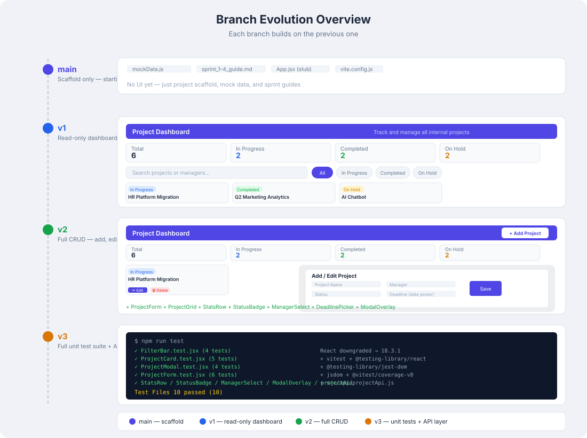

# Project Dashboard

A React-based internal project tracking dashboard that lets employees and managers view, search, filter, and manage all internal projects in one place.

---

## Table of Contents

1. [About the Project](#about-the-project)
2. [Tech Stack](#tech-stack)
3. [Prerequisites](#prerequisites)
4. [Getting Started](#getting-started)
5. [Project Structure](#project-structure)
6. [Architecture & Internal Working](#architecture--internal-working)
7. [Components](#components)
8. [Data Layer](#data-layer)
9. [Available Scripts](#available-scripts)
10. [Branches](#branches)
11. [Sprint Breakdown](#sprint-breakdown)
12. [Troubleshooting](#troubleshooting)

---

## About the Project

The Project Dashboard is a single-page application (SPA) built with React 19 and Vite. It provides:

- (main) Vite + React project scaffold with mock data layer (`mockData.js`) and sprint guide files — starting point before any UI is built
- (v1+) A summary stats row showing total, in-progress, completed, and on-hold project counts
- (v1+) A search bar to filter projects by name or manager
- (v1+) Status filter tabs (All / In Progress / Completed / On Hold)
- (v1+) A responsive card grid displaying each project with status badge, deadline countdown, and progress bar
- (v1+) A detail modal showing full project info and a task-by-task breakdown
- (v2+) Add, edit, and delete projects via a form modal
- (v2+) Refactored component architecture — StatsRow, ProjectGrid, StatusBadge, ManagerSelect, DeadlinePicker, ModalOverlay
- (v3+) Full unit test coverage using Vitest and React Testing Library
- (v3+) Real Spring Boot REST API backend replacing the mock data layer

---

## Tech Stack

### Frontend (all branches)

| Layer | Technology |
|-------|-----------|
| UI Framework | React 19 (React 18.3.1 on v3) |
| Build Tool | Vite 8 (Vite 5 on v3) |
| Styling | Plain CSS with CSS Custom Properties |
| Date Picker | react-datepicker (v2+) |
| Testing | Vitest + React Testing Library (v3+) |
| Linting | ESLint 9 |

### Backend (v3 branch only)

| Layer | Technology |
|-------|-----------|
| Language | Java 17 |
| Framework | Spring Boot 3.2.5 |
| ORM | Spring Data JPA |
| Database | H2 in-memory (auto-seeded on startup) |
| Boilerplate reduction | Lombok |
| Date serialization | Jackson JSR310 (`LocalDate` → `"yyyy-MM-dd"`) |

---

## Prerequisites

### For all branches (main, v1, v2, v3)

| Tool | Minimum Version | Purpose |
|------|----------------|---------|
| Node.js | 18.x or higher | JavaScript runtime |
| npm | comes with Node | Package manager |
| Git | any recent | Version control |

```bash
node -v
npm -v
```

Download Node.js from https://nodejs.org (choose the LTS version) if not installed.

### Additional prerequisites for v3 branch only

| Tool | Minimum Version | Purpose |
|------|----------------|---------|
| Java | 17 or higher | Spring Boot runtime |
| Maven | 3.x | Build and run the backend |

```bash
java -version
mvn -version
```

Download Java 17 from https://adoptium.net if not installed.

---

## Getting Started

### Branches main / v1 / v2 (frontend only)

```bash
# 1. Clone and switch to the desired branch
git clone <repository-url>
cd demo-application
git checkout v2   # or main, v1

# 2. Install dependencies
npm install

# 3. Start the development server
npm run dev
```

Open `http://localhost:5173` in your browser.

### Branch v3 (React frontend + Spring Boot backend)

v3 replaces the mock data layer with a real Spring Boot REST API. Both servers must be running.

**Terminal 1 — start the Spring Boot backend:**
```bash
cd project-dashboard-api
mvn spring-boot:run
```
Wait for: `Started ProjectDashboardApiApplication in X.XXX seconds`
Backend is now live at `http://localhost:8080`

**Terminal 2 — start the React frontend:**
```bash
cd demo-application
git checkout v3
npm install
npm run dev
```

Open `http://localhost:5173` in your browser.

> Vite proxies all `/api` requests to `http://localhost:8080` automatically — no CORS issues.

---

## Project Structure

```
demo-application/
├── public/
│   ├── favicon.svg
│   └── icons.svg
├── src/
│   ├── __tests__/              # Unit tests (v3 branch only)
│   │   ├── FilterBar.test.jsx
│   │   ├── ProjectCard.test.jsx
│   │   ├── ProjectModal.test.jsx
│   │   ├── ProjectForm.test.jsx
│   │   ├── ProjectGrid.test.jsx
│   │   ├── StatsRow.test.jsx
│   │   ├── StatusBadge.test.jsx
│   │   ├── ManagerSelect.test.jsx
│   │   ├── ModalOverlay.test.jsx
│   │   └── projectApi.test.js
│   ├── api/
│   │   └── projectApi.js       # Real fetch() HTTP calls to Spring Boot (v3 only)
│   ├── assets/
│   │   └── hero.png
│   ├── components/
│   │   ├── FilterBar.jsx       # Search input + status filter tabs (v1+)
│   │   ├── ProjectCard.jsx     # Individual project card (v1+)
│   │   ├── ProjectModal.jsx    # Project detail popup (v1+)
│   │   ├── ProjectForm.jsx     # Add/Edit form modal (v2+)
│   │   ├── ProjectGrid.jsx     # Card grid with loading/empty states (v2+)
│   │   ├── StatsRow.jsx        # Summary stats bar (v2+)
│   │   ├── StatusBadge.jsx     # Reusable status badge (v2+)
│   │   ├── ManagerSelect.jsx   # Manager dropdown (v2+)
│   │   ├── DeadlinePicker.jsx  # Date picker wrapper (v2+)
│   │   └── ModalOverlay.jsx    # Reusable modal wrapper (v2+)
│   ├── data/
│   │   └── mockData.js         # Static project data + fake async API (main/v1/v2)
│   ├── App.jsx                 # Root component, holds all state + CRUD handlers
│   ├── App.css                 # All dashboard styles
│   ├── index.css               # Global reset + root layout
│   ├── main.jsx                # React DOM entry point
│   └── setupTests.js           # Vitest global test setup (v3 only)
├── GUIDE.md                    # Full step-by-step build guide
├── representation.md           # Architecture documentation (v1+)
├── sprint_1_guide.md           # Sprint 1 task guide
├── sprint_2_guide.md           # Sprint 2 task guide
├── sprint_3_guide.md           # Sprint 3 task guide
├── sprint_4_guide.md           # Sprint 4 task guide
├── sprint_5_guide.md           # Sprint 5 task guide (v2+)
├── sprint_6_guide.md           # Sprint 6 task guide (v2+)
├── sprint_7_guide.md           # Sprint 7 task guide (v2+)
├── sprint_8_guide.md           # Sprint 8 task guide (v2+)
├── sprint_9_guide.md           # Sprint 9 task guide (v2+)
├── sprint_10_guide.md          # Sprint 10 task guide (v2+)
├── vite.config.js              # Vite config — includes /api proxy for v3
├── vitest.config.js            # Vitest configuration (v3 only)
├── eslint.config.js
└── package.json
```

---

## Architecture & Internal Working

### Data Flow

The application follows React's unidirectional data flow pattern:

```
── v1/v2: mockData.js ──────── v3: projectApi.js (fetch → Spring Boot :8080)
        │
        │  fetchProjects() called on mount via useEffect
        ▼
    App.jsx  ←── Single source of truth for all state
        │
        ├──▶ StatsRow.jsx  (v2+)
        │       receives: projects[] (full unfiltered list)
        │       renders: total / in-progress / completed / on-hold counts
        │
        ├──▶ FilterBar.jsx
        │       receives: search (string), filter (string) — stateless
        │       calls back: onSearch → setSearch, onFilter → setFilter
        │       effect: App re-renders → filtered list updates instantly
        │
        ├──▶ ProjectGrid.jsx (v2+) → ProjectCard.jsx (one per filtered project)
        │       receives: loading, projects[], onCardClick
        │       calls back: onCardClick → setSelected(project)
        │       effect: selected state is set → detail modal opens
        │
        ├──▶ ProjectModal.jsx
        │       receives: project (selected or null)
        │       calls back: onClose → setSelected(null)
        │                   onEdit (v2+)   → setFormProject(project)
        │                   onDelete (v2+) → calls API (v3) or filters state (v2)
        │
        └──▶ ProjectForm.jsx  (v2+)
                receives: initial project data (null = add mode)
                calls back: onSave → calls createProject/updateProject API (v3)
                                     or updates state directly (v2)
                            onCancel → closes form
```

### State Management (App.jsx)

All state lives in `App.jsx` — the highest component that needs it:

| State variable | Initial value | Purpose |
|---------------|--------------|---------|
| `projects` | `[]` | Full list of projects from the mock API |
| `loading` | `true` | Controls the loading spinner visibility |
| `search` | `""` | Current text in the search input |
| `filter` | `"All"` | Currently active status tab |
| `selected` | `null` | Project shown in the detail modal (`null` = closed) |
| `formProject` | `null` | Project being added/edited (`null` = form closed) |

### Filtering Logic

Filtering runs on every render — no button press needed:

```js
const filtered = projects.filter((p) => {
  const matchesFilter = filter === "All" || p.status === filter;
  const matchesSearch =
    p.name.toLowerCase().includes(search.toLowerCase()) ||
    p.manager.toLowerCase().includes(search.toLowerCase());
  return matchesFilter && matchesSearch;
});
```

Both conditions must be true (`&&`) for a project to appear in the grid.

### Rendering States

The main content area has three possible states rendered via nested ternary:

```
loading === true  →  show spinner
filtered.length === 0  →  show "No projects match" message
otherwise  →  show card grid
```

### CSS Architecture

Styles use CSS Custom Properties defined in `:root` for a single-source-of-truth color system:

```css
:root {
  --bg: #f0f2f7;
  --surface: #ffffff;
  --accent: #4f46e5;
  --green: #16a34a;
  --amber: #d97706;
  --red: #dc2626;
  --blue: #2563eb;
}
```

The card grid uses `repeat(auto-fill, minmax(340px, 1fr))` — columns automatically adjust to screen width with no media queries.

---

## Components

### FilterBar
Stateless controlled component — receives `search` and `filter` values as props from App.jsx and calls `onSearch` / `onFilter` callbacks on every keystroke or tab click. Renders a text input and four status tab buttons (All / In Progress / Completed / On Hold). The active tab gets an `active` CSS class dynamically.

### ProjectCard
Displays a single project as a clickable card. In v1 it calculates a deadline countdown (overdue / soon / normal) and renders a progress bar inline. In v2+ it delegates the status badge to `StatusBadge` and the deadline is displayed as-is from the data. Calls `onClick(project)` when clicked to open the detail modal.

### ProjectModal
Overlay showing full project details: name, status badge, description, manager, and deadline. In v1 it also shows a progress bar and task list with per-task status indicators. In v2+ it adds **Edit** (✏️) and **Delete** (🗑️) action buttons. Closes on overlay click (via `stopPropagation` on the inner box) or the ✕ button.

### ProjectForm *(v2+)*
Add/Edit form modal with fields for: project name, manager (dropdown), status, deadline (date picker), and description. Operates in add mode when `initial` prop is `null`, edit mode when `initial` is a project object (form pre-fills with existing data). Validates that name, manager, and deadline are non-empty before calling `onSave`.

### ProjectGrid *(v2+)*
Handles the three main content states — loading, empty, and card grid — keeping App.jsx cleaner. Receives `loading` (bool), `projects` (filtered array), and `onCardClick` as props.

### StatsRow *(v2+)*
Receives the full (unfiltered) `projects` array and derives the four counts (Total, In Progress, Completed, On Hold) internally. Always reflects the total database/state count, not just what is visible on screen.

### StatusBadge *(v2+)*
Reusable pill badge that builds its CSS class dynamically: `"badge badge-" + status.toLowerCase().replace(" ", "-")`. Used by both `ProjectCard` and `ProjectModal`.

### ManagerSelect *(v2+)*
Dropdown populated from existing manager names in the projects list. Includes a `➕ Add New Manager` option that switches to a free-text input, with a ✕ button to cancel back to the dropdown.

### DeadlinePicker *(v2+)*
Wrapper around `react-datepicker` that converts between the stored `"yyyy-MM-dd"` string and the `Date` object the picker requires. Past dates are disabled (`minDate={new Date()}`). Includes month and year dropdowns for quick navigation.

### ModalOverlay *(v2+)*
Reusable dark backdrop wrapper used by both `ProjectModal` and `ProjectForm`. Clicking the dark background calls `onClose`; clicking inside the white modal box stops propagation so the modal stays open.

---

## Data Layer

### mockData.js

Contains 6 hardcoded project objects and a `fetchProjects` function that simulates a 700ms network delay using a Promise + setTimeout:

```js
export const fetchProjects = () =>
  new Promise((resolve) => setTimeout(() => resolve(mockProjects), 700));
```

Each project object has: `id`, `name`, `manager`, `status`, `progress`, `deadline`, `description`, `tasks[]`.

Each task has: `id`, `title`, `status` (Done / In Progress / Pending).

### projectApi.js *(v3 only)*

Replaces `mockData.js` entirely with real `fetch()` HTTP calls to the Spring Boot backend running at `http://localhost:8080`. The Vite dev server proxies `/api` → `http://localhost:8080` so components never reference the backend port directly.

| Function | HTTP Method | Endpoint | Response |
|---|---|---|---|
| `fetchProjects()` | `GET` | `/api/projects` | `200` + project array |
| `createProject(data)` | `POST` | `/api/projects` | `201` + new project |
| `updateProject(id, data)` | `PUT` | `/api/projects/:id` | `200` + updated project |
| `deleteProject(id)` | `DELETE` | `/api/projects/:id` | `204` no body |

All four functions are imported directly into `App.jsx` and called from the `handleAdd`, `handleEdit`, and `handleDelete` handlers. Each handler is wrapped in `try/catch` — if the backend is not running, an alert is shown to the user instead of a silent failure.

### Spring Boot Backend *(v3 only)*

The backend project (`project-dashboard-api/`) is a separate Spring Boot application with a strict layered architecture:

```
project-dashboard-api/src/main/java/com/dashboard/api/
├── controller/   ProjectController.java   ← HTTP routing only
├── service/      ProjectService.java      ← business logic, DTO mapping
├── repository/   ProjectRepository.java   ← extends JpaRepository
├── entity/       Project.java             ← @Entity, LocalDate deadline
├── dto/          ProjectDTO.java          ← API contract with React
└── exception/    ProjectNotFoundException ← auto 404 via @ResponseStatus
```

- `schema.sql` — drops and recreates the `project` table on every startup
- `data.sql` — seeds 4 default projects into H2 on every startup
- `deadline` is stored as a proper `DATE` column (not a string), mapped to `LocalDate` in Java
- H2 console available at `http://localhost:8080/h2-console` (JDBC URL: `jdbc:h2:mem:dashboarddb`, user: `sa`, no password)

---

## Available Scripts

### React frontend (all branches)

```bash
npm run dev            # Start development server at http://localhost:5173
npm run build          # Create production build in /dist
npm run preview        # Serve the production build locally
npm run lint           # Run ESLint across all source files
npm run test           # Run unit tests with Vitest (v3 branch only)
npm run test:coverage  # Run tests with coverage report (v3 branch only)
```

### Spring Boot backend (v3 branch only)

```bash
# Run from the project-dashboard-api/ directory
mvn spring-boot:run    # Start backend at http://localhost:8080
mvn clean package      # Build a deployable JAR
```

---

## Branches

There are **4 branches** in this repository:



### `main`
The base branch containing the initial project scaffold. Includes the Vite + React setup, folder structure, and the sprint guide files. The application code is minimal — this is the starting point before any features are built.

**Contains:**
- Vite + React 19 scaffold
- `src/data/mockData.js` with 6 mock projects
- Sprint guide files (`sprint_1_guide.md` through `sprint_4_guide.md`)
- Basic `App.jsx` and `App.css` stubs

---

### `v1`
The first complete working version of the dashboard. Built across 4 sprints by the team. Implements the full read-only dashboard with search, filtering, and project detail modal.

**Contains everything in `main`, plus:**
- Complete `App.jsx` with state management and filtering logic
- `FilterBar.jsx` — search input + status filter tabs
- `ProjectCard.jsx` — project card with deadline countdown and progress bar
- `ProjectModal.jsx` — detail modal with task list
- Full `App.css` dashboard styles
- `representation.md` — architecture documentation

**Key features:**
- View all 6 projects in a responsive card grid
- Search by project name or manager name
- Filter by status: All / In Progress / Completed / On Hold
- Click a card to open a detail modal with task breakdown
- Loading spinner on initial data fetch

---

### `v2`
An upgraded version that adds full CRUD (Create, Read, Update, Delete) capabilities. The component architecture is also refactored — monolithic components are split into smaller, focused pieces.

**Contains everything in `v1`, plus:**
- `ProjectForm.jsx` — Add/Edit project form modal
- `ProjectGrid.jsx` — Extracted card grid with loading/empty states
- `StatsRow.jsx` — Extracted stats summary bar
- `StatusBadge.jsx` — Reusable status badge component
- `ManagerSelect.jsx` — Manager dropdown for the form
- `DeadlinePicker.jsx` — Date picker wrapper using `react-datepicker`
- `ModalOverlay.jsx` — Reusable modal backdrop
- New dependency: `react-datepicker ^9.1.0`
- Extended sprint guides (`sprint_5_guide.md` through `sprint_10_guide.md`)

**Key features (on top of v1):**
- "+ Add Project" button in the header
- Edit a project from its detail modal
- Delete a project from its detail modal
- Form validates and saves changes back to state in real time

---

### `v3`
The most complete version. Replaces the mock data layer with a real **Java Spring Boot REST API** backed by an **H2 in-memory database**. Also adds a full unit test suite and downgrades React to 18.3.1 for testing library compatibility.

**Contains everything in `v2`, plus:**
- `src/api/projectApi.js` — real `fetch()` HTTP calls to Spring Boot (`GET`, `POST`, `PUT`, `DELETE`)
- `vite.config.js` proxy — forwards `/api` → `http://localhost:8080` (no CORS issues):
  ```js
  server: { proxy: { '/api': { target: 'http://localhost:8080', changeOrigin: true } } }
  ```
- `src/__tests__/` — 10 unit test files covering all components and the API layer
- `src/setupTests.js` — imports `@testing-library/jest-dom` globally for all tests
- `vitest.config.js` — Vitest with jsdom environment and globals enabled
- New dev dependencies: `vitest`, `@testing-library/react`, `@testing-library/jest-dom`, `@testing-library/user-event`, `@vitest/coverage-v8`, `jsdom`
- React downgraded to `18.3.1` for testing library compatibility

**Spring Boot backend (`project-dashboard-api/` — separate project):**
- Java 17 + Spring Boot 3.2.5 + Spring Data JPA
- H2 in-memory database — auto-seeded with 4 projects via `schema.sql` + `data.sql` on every startup
- REST endpoints: `GET /api/projects`, `POST /api/projects`, `PUT /api/projects/{id}`, `DELETE /api/projects/{id}`
- Layered architecture: Controller → Service → Repository → Entity → DTO
- `ProjectNotFoundException` with `@ResponseStatus(404)` — auto-returns 404 for missing projects
- `deadline` stored as `DATE` column mapped to `LocalDate` in Java, serialized as `"yyyy-MM-dd"` by Jackson JSR310
- H2 console at `http://localhost:8080/h2-console` — JDBC URL: `jdbc:h2:mem:dashboarddb`, user: `sa`, no password
- Data persists across page refreshes (stored in H2), resets when Spring Boot restarts

**Test files:**
| Test File | What it covers |
|-----------|---------------|
| `FilterBar.test.jsx` | Search input and tab filter interactions |
| `ProjectCard.test.jsx` | Card rendering, deadline display, click handler |
| `ProjectModal.test.jsx` | Modal open/close, task list rendering |
| `ProjectForm.test.jsx` | Add/edit form fields and submission |
| `ProjectGrid.test.jsx` | Loading state, empty state, card grid rendering |
| `StatsRow.test.jsx` | Stat counts derived from project data |
| `StatusBadge.test.jsx` | Badge CSS class mapping per status |
| `ManagerSelect.test.jsx` | Dropdown options and selection |
| `ModalOverlay.test.jsx` | Overlay click-to-close behavior |
| `projectApi.test.js` | API layer mock and data shape |

---

## Sprint Breakdown

### v1 — Sprints 1–4

| Sprint | File | Assignee | Deliverable |
|--------|------|----------|-------------|
| Sprint 1 | `sprint_1_guide.md` | Team Member 1 | Project scaffold + `mockData.js` |
| Sprint 2 | `sprint_2_guide.md` | Team Member 2 | `FilterBar.jsx` + `ProjectCard.jsx` |
| Sprint 3 | `sprint_3_guide.md` | Team Member 3 | `ProjectModal.jsx` + `App.jsx` wiring |
| Sprint 4 | `sprint_4_guide.md` | Team Member 4 | CSS styling + final integration & QA |

### v2 — Sprints 5–10

| Sprint | File | Deliverable |
|--------|------|-------------|
| Sprint 5 | `sprint_5_guide.md` | `ModalOverlay.jsx` + `StatusBadge.jsx` |
| Sprint 6 | `sprint_6_guide.md` | `StatsRow.jsx` + `ProjectGrid.jsx` |
| Sprint 7 | `sprint_7_guide.md` | `ManagerSelect.jsx` + `DeadlinePicker.jsx` |
| Sprint 8 | `sprint_8_guide.md` | `ProjectForm.jsx` (Add/Edit modal) |
| Sprint 9 | `sprint_9_guide.md` | Wire CRUD handlers in `App.jsx` |
| Sprint 10 | `sprint_10_guide.md` | Final integration, QA, and CSS updates |

---

## Troubleshooting

### Frontend (all branches)

| Symptom | Fix |
|---------|-----|
| Blank page on load | Open F12 → Console and check for import path errors |
| Cards not showing | Confirm `src/data/mockData.js` exports `fetchProjects` |
| Spinner never stops | Confirm `setLoading(false)` is called inside `.then()` in App.jsx |
| Modal won't close on overlay click | Confirm `e.stopPropagation()` is on the inner `.modal` div |
| Layout broken / too narrow | Confirm `#root` in `index.css` has `width: 100%` |
| Tests failing on v3 | Ensure you are on the `v3` branch and ran `npm install` after switching |
| `react-datepicker` not found | Run `npm install` — it is a v2+ dependency not present in v1 |

### Backend / Full-stack (v3 branch only)

| Symptom | Fix |
|---------|-----|
| "Failed to add project. Is the backend running?" alert | Start Spring Boot: `mvn spring-boot:run` in `project-dashboard-api/` |
| Cards never load on v3 (spinner stays) | Backend is not running or port 8080 is blocked — check Terminal 1 |
| `Port 8080 already in use` error | Another process is using 8080 — stop it or change `server.port` in `application.properties` |
| H2 console login fails | Use JDBC URL `jdbc:h2:mem:dashboarddb`, username `sa`, password empty |
| Data disappears after backend restart | Expected — H2 is in-memory; `data.sql` re-seeds the 4 default projects automatically |
| `java: command not found` | Install Java 17 from https://adoptium.net |
| `mvn: command not found` | Install Maven from https://maven.apache.org |
